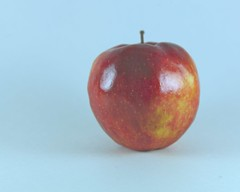
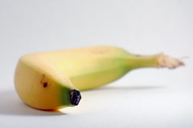
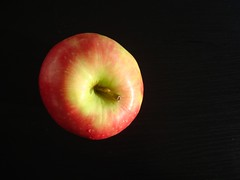
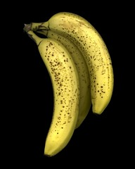
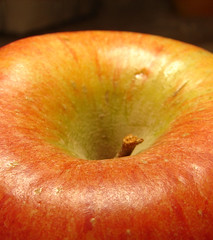
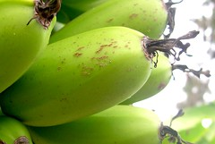

# Banapple

[](https://github.com/innoisys/Banapple/)
[](README.md)
[](https://opensource.org/licenses/MIT)

This is the official repository for the Interpretability Dataset "Banapple". This dataset is associated with the paper
**"E pluribus unum interpretable convolutional neural networks"**. The code for the paper can be
found [here](https://github.com/innoisys/EPU-CNN).

## Details

For the purposes of the study presented in **"E pluribus unum interpretable convolutional neural networks"**,
a novel dataset was constructed, named **Banapple**. The dataset consists of images of bananas and apples. It was
created
by collecting images, under the **Creative Commons license**, from **Flickr**.

### Motivation

The images illustrate bananas and apples with variations regarding the color, placement, size, and background.
The motivation for the construction of this dataset stems from studies in cognitive science, where human perception is
investigated using
examples with discrete properties of bananas and apples. The experiments performed aim to demonstrate that **EPU-CNN**
is
capable of capturing the discriminative characteristics of bananas and apples by the perceptual features it
incorporates, _i.e._, apples have a circular shape and usually red color, whereas bananas have a bow-like shape and
usually a yellow color.

In addition, samples that deviate from the average appearance of these objects can provide
insights regarding the reliability of the interpretation of the model.
The dataset consists of images of bananas and apples.

### Dataset

Banapple consists of 2,313 images of bananas and apples. The images are divided into three partitions for training,
validation and testing.

***
**- Training: 1,666 images**

**- Validation: 417 images**

**- Testing: 230 images**
***

The images are in JPEG format and have various sizes. The filenames of the images are in the
format `{class}{imageIndex}.jpg}`,
where `class` is either `apple` or `banana`, and `imageIndex` is a number between 1 and 2313, _e.g._, `apple458.jpg`.

Some samples from the dataset are shown below.

|       Class: apple       |       Class: banana       |
:------------------------:|:-------------------------:
  |   
  |  
  |  

### Download

You can download the dataset
from [here](https://drive.google.com/drive/folders/1GAJYR2pr8UVM-euQuIbW2-i0ZJfuH35W?usp=sharing).

## Citation

If you find this work useful, please cite our paper:

```
@article{dimas2022pluribus,
  title = {E Pluribus Unum Interpretable Convolutional Neural Networks},
  author = {Dimas, George and Cholopoulou, Eirini and Iakovidis, Dimitris K},
  journal = {arXiv preprint arXiv:2208.05369},
  year = {2022}
}
```

## TODO

- [] Add a download script
- [] Add a dataset management Class (e.g. `BanappleDataset`)
- [] Replace the .arxiv reference with the Scientific Reports reference

## Contributors

- [George Dimas](gdimas@uth.gr)
- [Eirini Cholopoulou](echolopoulou@uth.gr)
- [Dimitris Iakovidis](diakovidis@uth.gr)
